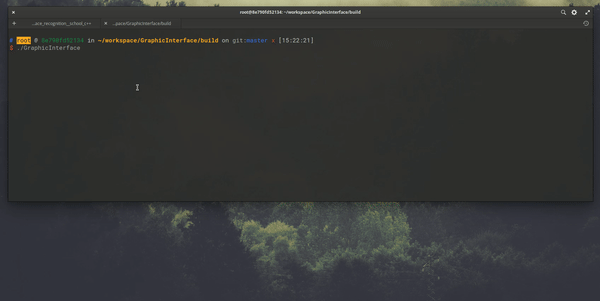
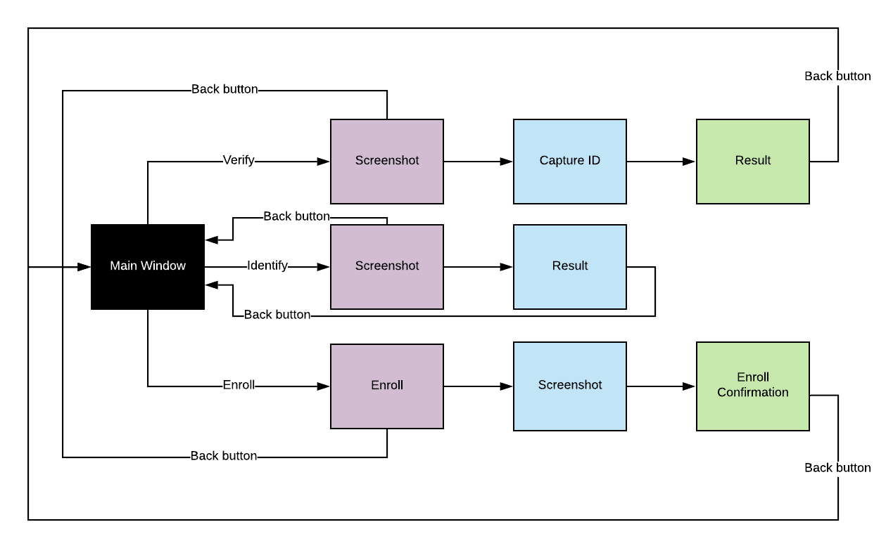
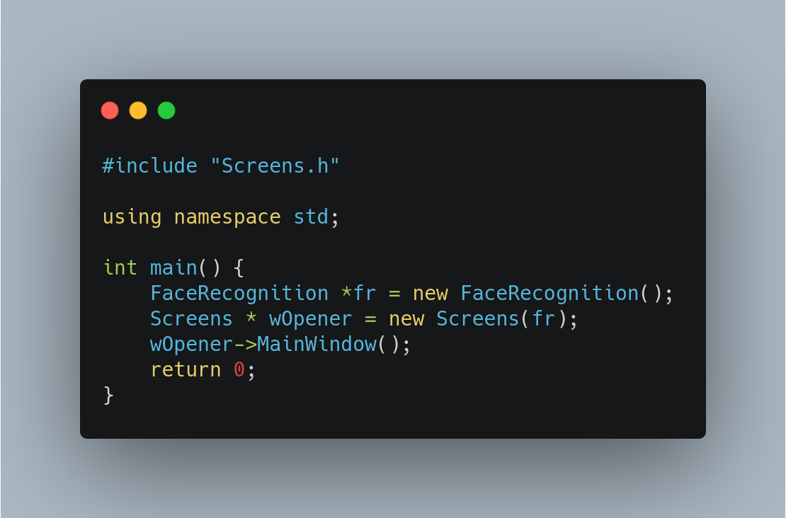

# TC2004-FaceRecognition-Spring2020

**Face Recognition System** is a C++ project to recognize members of Tecnológico de Monterrey CSF

## VULTUS Software

<div align="center">
    
</div>

### Description

- The system recognizes members of Tecnológico de Monterrey CSF.
- The system throws alerts in case the credential does not match the face.
- The system allows to authenticate (comparing) the data of the students with those of the credential.
- The system grants access if the data matches.
- The system shows an alert whether or not he/she is the person.
- The system allows the enrollment of new students.
- The system verifies or identifies the student.

### Highlights

- The system runs in macOS (10.14+), Linux (Ubuntu 18.04+), (Windows not officially supported, but might work).
- Data in the system stays safe and secure.
- Written in C++.

#### Tests

|  Method  | Windows  |   Mac    | Linux |
| :------: | :------: | :------: | :---: |
|  Verify  | untested | untested | untested |
| Identify | untested | untested | untested |
|  Enroll  | untested | untested | untested |

## Dependencies

Below are the dependencies used in this project:

- [OpenCV](https://docs.opencv.org/master/d7/d9f/tutorial_linux_install.html)
- [Dlib](https://github.com/davisking/dlib)
- [Mongocxx Driver](http://mongocxx.org/mongocxx-v3/installation/)
- [MongoDB](https://www.mongodb.com/download-center/community)
- [CMake](https://cmake.org/download/)

## Get started

### Install

#### Option 1 (from source)

```sh
git clone https://github.com/leonardochang36/TC2004-FaceRecognition-Spring2020.git

cd TC2004-FaceRecognition-Spring2020 && cd GraphicInterface && mkdir build && cd build && cmake .. && make
```

***NOTE:*** You must have installed all dependencies correctly

#### Option 2 (docker)

https://hub.docker.com/repository/docker/robtry/face-recognition

```sh
docker pull robtry/face-recognition

# Enable xhost ! (Mac & Linux)
xhost +

# Get the system
git clone https://github.com/leonardochang36/TC2004-FaceRecognition-Spring2020.git

# Linux
docker run --privileged --device /dev/video0:/dev/video0 -v $(pwd):/root/workspace -v /tmp/.X11-unix:/tmp/.X11-unix -e DISPLAY=$DISPLAY -p 5000:5000 -p 8888:8888 -it robtry/face-recognition

# Mac
docker run -it -v $(pwd):/root/workspace -v /tmp/.X11-unix:/tmp/.X11-unix -e DISPLAY=docker.for.mac.host.internal:0  -p 5000:5000 -p 8888:8888 robtry/face-recognition

# Compile and run it
cd TC2004-FaceRecognition-Spring2020 && cd GraphicInterface && mkdir build && cd build && cmake .. && make
```

- ***NOTE:*** To use webcam you must be in linux.
- ***NOTE:*** GUI can be use in Mac.
- ***NOTE:*** You can only use CLI if you're on Windows.

### Set up database

1. Download info [here](https://drive.google.com/open?id=1wuv9Cy0vV7tKd2-CxW3BoRb9rgM2S2km)
2. Decompress `ImgFiles.zip` and `MatFiles.zip`
3. Substitute in `Database/storage/`

### Run

```sh
./GraphicInterface
```

***NOTE:*** There must be a camera attached to the computer for the program to work fully.

### How to use

#### GUI

<div align="center">
	
</div>

Inside the code, the main functions that are used are the following:

**_GUI.cpp_**

<div align="center">
    
</div>


**_Screens.cpp_**

Inside this script the menu buttons are displayed and the respective functions are executed once the button is pressed. The buttons and funtionalities of each are teh following:

- "Face Verification": Calls the main verify method (full description below).
- "Face identification": Calls the main identify method (full description below).
- "Enroll a Student": Calls the main enroll method, it allows for a new user to be registered in the database. It needs the name, ID, age and picture of the before-mentioned user.
- "Quit": Exits the program.

#### Verify

This method verifies if the subject in frame matches the subject in database for a given ID. It uses the modules Face Detection, Face Alignment and Features Extraction modules to get the features of the subject in frame, then uses the module Database to get the features saved for the ID given and compares both features.

##### Parameters

- Frame: cv::Mat object of the frame captured.
- ID: std::string of Id
- Response: integer that will contain the response of the verification. 1 for same person, 0 for not matched and -1 for method error.
- Result: Cuatec object that, in case of match, will contain the matching Cuatec found in DB.

#### Identify

This method unites the face detection, face alignment, feature extraction and database modules into one. It identifies a face and returns an amount of possible matches to said face.

##### Parameters

- frame: a Mat object of the current frame being captured.
- response: an integer that will contain the response of the identification (1 for a match and 0 for no match).
- result: a vector of type Cuatec that will save all the possible matches of the identification.

The method begins by creating an empty Mat object called "features", which will be used as an argument along with the current frame when calling `getFeatureDescriptorsFromFrame()`. That method encapsulates the first three modules of this system (face detection, face alignment and feature extraction),takes "features" and "near_neighbors" as arguments and once all 3 modules have done their piece of work, a boolean variable is returned. If it was returned as true, it means all 3 modules worked fine, so "result" will be filled with possible matches to the face in the current frame via a call to `fastSearch()`(a method provided by the database module), which takes as arguments the now filled "features" Mat object and "near_neighbors" (the amount of possible matches desired to be seen). Provided the first position inside of "result" will have the most likely match of the person being identified, a call is made to `verify()`, which will take as arguments the same received frame, the cuatecID of the first person in "result", newly defined and initialized "verfiedResponse" integer and an object of type "Cuatec" named "cuatecRseult". The response value that comes from `verify()` will determine the value for "response". If its equal to 1, then so is "response" and there was a match. If its equal to 0, then so is "response" and there was no match. If the boolean returned from `getFeatureDescriptorsFromFrame()` was returned as false, the person using the system is notified through an "Error" message and "response" is saved as 0.

#### Enroll user

This methods allows the user to enroll a new student. In order to enroll the student, the methods recieves the name (string), age (int) and id (string) as a unique key. While the MAT object, comes from the picture taken by the opeaning camara. In order to insert in the database, the picture must: detect the face to be inserted, align the picture and detect a vector of 128 dimension with its features. We use the "getFeaturesDescriptorsFromFrame" function to determine its feature vector. The response (int) parameter in function determines whether the insertion was successful (1)  or unsuccesful (0).

##### Parameters

- Age: an int that is an input from user
- Id : string recieved from user and key in database 
- Name: string that is an input from user
- Response: an int that indicates whether student was successfully enrolled or not.

## Authors

- [Leonardo Chang](https://github.com/leonardochang36) | Project Manager.
- [Team 1](https://github.com/sergio-hernandez-castillo/FaceDetection) : Face Detection | One to Many comparison.
- [Team 2](https://github.com/robtry/face-alignment) : Face Alignment | Integration.
- [Team 3](https://github.com/cxrlos/Computer_Vision) : Feature Extraction | GUI.
- [Team 4](https://github.com/saulmontesdeoca/faceRecognitionDB) : Database | One to One comparison.

_Copyright © 2020 ITESM CSF_
